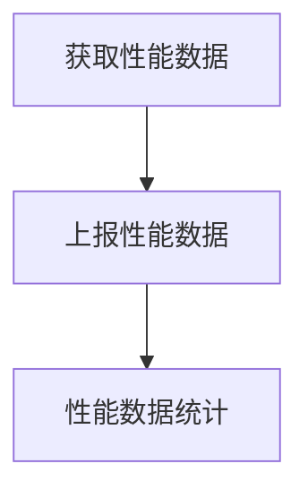

# 移动端性能监控

## 介绍

* 通过对不同的性能指标的监控找出 app 的性能短板，以便后续做出针对性优化；
* 移动端使用 Android 为例，后端代码使用 Python 实现。

## 性能监控原理



* 获取性能数据
    * 获取性能数据前先制定性能指标，然后寻找一些获取性能数据的切入点，通过插桩的形式，无侵入性的增加一些统计代码，从而在完全不影响业务代码的情况下统计性能数据。
    * 性能指标
        * 启动时间

      ```json
      {
        "element_name": "startup",
        "element_type": "init",
        "extra": {
          "during": 30
        },
        "common": {
          "app": "performance-demo",
          "version": "0.0.1",
          "platform": "android",
          "other": "其他公参"
        }
      }
      ```

      element_type: 启动类型，首次启动（"init"）、冷启动（"cold"）、热启动（"hot"）

      during: 耗时，单位毫秒

      首次启动或冷启动时间:

      ***Android***: Application.<init>() 开始到 MainActivity.onResume() 结束

      ***iOS****: main 函数启动时间(SDK启动时间) 到 FirstVC.viewDidAppear()结束

      热启动时间:

      ***Android***:

      *Home*键: Activity.onRestart() 开始到 Activity.onResume() 结束

      *Back*键: Activity.onCreate() 开始到 Activity.onResume() 结束

      ***iOS****: applicationWillEnterForeground() 开始到 applicationDidBecomeActive() 结束

        * 操作体验

      ```json
      {
        "element_name": "operate",
        "element_type": "click",
        "extra": {
          "during": 30,
          "widget": "",
          "page": ""
        },
        "common": {
          "app": "performance-demo",
          "version": "0.0.1",
          "platform": "android",
          "other": "其他公参"
        }
      }
      ```

      element_type: 操作类型，点击（"click"）、列表点击（"itemClick"）、长按（"longClick"）

      during: 耗时，单位毫秒

      widget: 控件，Android: 类名 + 控件ID；iOS: 类名+⽅法名

      page: 页面，Android: Activity或Fragment名称；iOS: VC的名称

      监控方法:
        * Android: onClick、onItemClick、onLongClick
        * iOS*: UITapGestureRecognizer、UILongPressGestureRecognizer

      指标定义:

      > 阻塞耗时: 操作过程中⼊⼝函数的执⾏耗时（阻塞过程中⽤户⽆法进⾏任何操作）
      >
      > 失败操作: 操作过程中请求错误率达到100%的操作（操作过程中发出了三个请求，若三个请求都发⽣了错误，则此次操作为错误操作）
      >
      > 崩溃操作: 操作过程中应⽤出现崩溃/闪退的操作
      >
      > 流畅操作: 操作耗时未达到设定阈值的操作（默认阈值3S，可配置)
      >
      > 慢操作: 操作耗时超过设定阈值的操作（默认阈值3S，可配置)
      >
      > 卡顿操作: 阻塞耗时超过设定阈值的操作（默认阈值3S，可配置)

      计算公式:
      > 可⽤操作次数 = 总操作次数－失败操作次数－崩溃操作次数
      >
      > 可⽤性 = 可⽤操作次数/总操作次数
      >
      > 流畅操作占⽐ = 流畅操作次数 / 总操作次数
      >
      > 慢操作占⽐ = 慢操作次数 / 总操作次数
      >
      > 卡顿操作占⽐ = 卡顿操作次数 / 总操作次数
      >
      > 崩溃操作占⽐ = 崩溃操作次数 / 总操作次数
      >
      > 失败操作占⽐ = 失败操作次数 / 总操作次数

        * 页面体验

      ```json
      {
        "element_name": "page",
        "element_type": "interactive",
        "extra": {
          "during": 300,
          "page": ""
        },
        "common": {
          "app": "performance-demo",
          "version": "0.0.1",
          "platform": "android"
        }
      }
      ```

      指标定义
      > 页⾯⾸屏时间: 页⾯打开⾄内容展现完毕的时间（包含⽹络耗时）。从⾸个⽣命周期⽅法开始⾄回到主线程的最后⼀个异步调⽤⽅法结束。
      >
      > 慢可交互: 交互时间超过既定阈值的页⾯，默认阈值1000ms，可配置。
      >
      > 页⾯可交互时间: 页⾯打开⾄⽤户可以正常交互的时间。Android 从 onCreate/onStart 开始⾄ onResume 结束。iOS 从viewDidLoad /
      viewWillAppear 开始⾄最后⼀个 viewDidAppear 结束。单位ms
      >
      > 慢⾸屏: 展现时间超过既定阈值的页⾯，默认阈值3000ms，可配置。
      >
      > 页⾯慢可交互占⽐
      >
      > 定义: ⽤以衡量当前页⾯交互过程是否流畅。
      >
      > 计算公式: 慢可交互次数 / 页⾯打开次数
      >
      > 页⾯慢⾸屏占⽐
      >
      > 定义: ⽤以衡量当前页⾯展现内容是否完整
      >
      > 计算公式: 慢⾸屏次数 / 页⾯打开次数

        * 卡顿监控

      ```kotlin
      private fun startMonitor() {
            val frameCallback = object : Choreographer.FrameCallback {
            
                      override fun doFrame(frameTimeNanos: Long) {
                          currentFrameTime = System.currentTimeMillis()
                          if (currentFrameTime - lastFrameTime > 50) {
                              // currentFrameTime - lastFrameTime 为单帧时长，大于 50 ms 视为卡顿
                          }
                          Choreographer.getInstance().postFrameCallback(this)
                          lastFrameTime = currentFrameTime
                      }
                  }
            Choreographer.getInstance().postFrameCallback(frameCallback)
      }
      ```

      通过 AOP 的方式，将上述方法插入初始化 app 的方法中，如 Application 的 onCreate，即可在不侵入业务代码的情况下，监控 app
      卡顿信息。

    * 技术方案

      为了实现对业务代码的无侵入，采用 AOP 的方式去采集性能数据。AOP 是实现程序功能统一维护的一种技术，利用 AOP
      可以对业务逻辑的各个部分进行隔离，从而使得业务逻辑各部分之间的耦合性降低，提高程序的可重用性，同时大大提高了开发效率。因此
      AOP 的优势可总结为如下两点:
        * 无侵入性
        * 修改方便

      此外，AOP 不同于 OOP 将问题划分到单个模块之中，它把涉及到众多模块的同一类问题进行了统一处理。

      AOP 的主流框架有 [AspectJ](https://www.eclipse.org/aspectj/) 和 [ASM](https://asm.ow2.io/)。

      AspectJ 的使用简单，不需要理解任何 Java
      字节码相关的知识，就可以在很多情况下对字节码进行操控，但只能在一些固定的切入点来进行操作，如果想要进行更细致的操作则很难实现，它无法针对一些特定规则的字节码序列做操作；

      ASM 则对于字节码的操作非常地灵活，可以进行插入、删除、修改等操作，但上手难度相对较大，需要对 Java 字节码有比较充分的了解；

      在性能上和功能上 ASM 均优于 AspectJ，AspectJ 的优势仅在于上手容易，在对 Java 字节码不够了解时也能使用。

    * 以页⾯可交互时间为例，需要统计 onCreate 开始到 onResume 结束的耗时
        * AspectJ 方案

      ```kotlin
      @Before("execution(* androidx.appcompat.app.AppCompatActivity.onCreate(..))")
      @Throws(Throwable::class)
      fun activityOnCreateMethod(joinPoint: JoinPoint) {
          // 记录开始时间
      }
      
      @After("execution(* androidx.appcompat.app.AppCompatActivity.onResume(..))")
      @Throws(Throwable::class)
      fun activityOnResumeMethod(joinPoint: JoinPoint) {
          val target = joinPoint.target as? Activity ?: return
          val page = target.javaClass.simpleName
          // 记录结束时间，减去开始时间，得到可交互耗时
      }
      ```

        * ASM 方案

      ```kotlin
      class PerformanceClassTransformer : ClassTransformer {
      
          private val PERFORMANCE_HOOK = "com/android/demo/aop/PerformanceHook"
      
          override fun transform(context: TransformContext, klass: ClassNode): ClassNode {
      
              val className = klass.className
              val superName = klass.superName
      
              if (className.endsWith("Fragment") && superName.endsWith("Fragment")) {
                  klass.methods?.find { it.name == "onCreate" }?.instructions?.apply {
                      insert(createPageInsnList("interactiveStart"))
                  }
                  val lastInsnList = createPageInsnList("interactiveEnd")
                  klass.methods?.find { it.name == "onResume" }?.instructions?.apply {
                      getMethodExitInsnNodes()?.forEach {
                          insertBefore(it, lastInsnList)
                      }
                  }
              }
      
              return super.transform(context, klass)
          }
      
          private fun createPageInsnList(name: String): InsnList {
              return with(InsnList()) {
                  add(
                      FieldInsnNode(
                          GETSTATIC, PERFORMANCE_HOOK, "INSTANCE", "L${PERFORMANCE_HOOK};"
                      )
                  )
                  add(VarInsnNode(ALOAD, 0))
                  add(
                      MethodInsnNode(
                          INVOKEVIRTUAL, PERFORMANCE_HOOK, name, "(Ljava/lang/Object;)V", false
                      )
                  )
                  this
              }
          }
      
          private fun InsnList.getMethodExitInsnNodes() = iterator()
              ?.asSequence()
              ?.filterIsInstance(InsnNode::class.java)
              ?.filter {
                  it.opcode == RETURN ||
                  it.opcode == IRETURN ||
                  it.opcode == FRETURN ||
                  it.opcode == ARETURN ||
                  it.opcode == LRETURN ||
                  it.opcode == DRETURN ||
                  it.opcode == ATHROW
              }
      }
      ```

      ```kotlin
      object PerformanceHook {
      
          fun interactiveStart(fragment: Any?) {
              if (fragment !is Fragment) {
                  return
              }
              // 记录开始时间
          }
      
          fun interactiveEnd(obj: Any?) {
              if (obj !is Fragment) {
                  return
              }
              // 记录结束时间，减去开始时间，得到可交互耗时
          }
      }
      ```

    * 从代码中可以看出，AspectJ 的方案代码量要比 ASM 方案精简很多，但无法插入字节码中的任意位置，而只能插入指定位置；性能上，由于
      AspectJ 在编译时会加入一些模板代码，导致运行速度也不如 ASM 方案，当然对于整个项目中只进行少量插桩注入监控代码的话，性能上影响不大。

* 上报性能数据

  通过 Python 的 [Flask](https://github.com/pallets/flask) 框架编写接口，以供移动端调用，获取到性能数据后，写入数据库。

  ```python
  @app.route('/performance', methods=['POST'])
  def performance():
      form = request.form
      element_name = form['element_name']
      element_type = form['element_type']
      # 处理性能数据
      return '{"message": "成功"}'
  ```

* 性能数据统计

  通过 Flutter Web 调用 Python 接口实现相关图表在各种维度展现性能数据。
